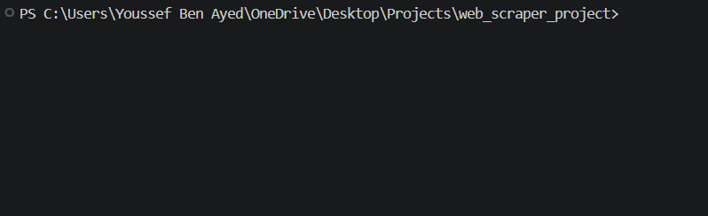

# تقرير تحليل موقع Portfolio — يوسف بن عياد

**الموقع:** https://youssef-deve-er.github.io/portfolio/
**الكوميت المُحلَّل:** `4f68929` — "Final update with auto-fit GIF containers"
**تاريخ المراجعة:** 26 يوليو 2026
**حجم المشروع:** 3 ملفات مصدرية (43 KB) + 11 MB صور GIF

---

## 1. الانطباع العام

المشروع **يستحق الثناء في المحتوى والفكرة**، لكنه **ضعيف في التنفيذ التقني**. نقاط القوة حقيقية:

- ✅ بنية HTML دلالية معقولة وأقسام منطقية (Hero → الرحلة → إحصائيات → خدمات → مشاريع → تواصل)
- ✅ فكرة **دراسة الحالة** لكل مشروع (الهدف / التقنيات / التحدي والحل) — هذه أقوى ميزة في الموقع وتميّزه عن 90% من البورتفوليوهات المبتدئة
- ✅ نظام ثنائي اللغة مع RTL/LTR بدون مكتبات خارجية
- ✅ الوضع الليلي/النهاري محفوظ في `localStorage`
- ✅ عرض GIF حي للمشاريع بدلاً من صور ثابتة
- ✅ صفر تبعيات خارجية (لا jQuery ولا Bootstrap) — كود نظيف ذاتي الاعتماد

لكن هناك **أخطاء ظاهرة للزائر مباشرة** تُضعف الانطباع الاحترافي، وأخطرها نموذج التواصل المكسور بصرياً و11 ميجابايت من الصور تُحمَّل دفعةً واحدة.

**التقييم:** 6.5/10 — أساس جيد، لكنه يحتاج جولة إصلاحات قبل عرضه على عميل أو صاحب عمل.

---

## 2. أخطاء حرجة (يجب إصلاحها فوراً)

### 🔴 2.1 نموذج التواصل مكسور بصرياً — CSS الـ Floating Label مفقود بالكامل

هذا **أوضح خطأ في الموقع** ويظهر لكل زائر.

في `index.html` استخدمتَ نمط الـ floating label:

```html
<input type="text" id="name" name="name" placeholder=" " required>
<label for="name">الاسم الكامل</label>
```

الـ `placeholder=" "` (مسافة) هو حيلة تعمل **فقط** مع قاعدة CSS مثل `input:placeholder-shown + label`. لكن بحثتُ في `style.css` كاملاً:

```
grep -n "label" style.css  →  لا توجد أي نتيجة
```

**النتيجة الفعلية:** الحقول تظهر **فارغة تماماً بلا أي نص إرشادي**، والكلمات "الاسم الكامل" و"البريد الإلكتروني" و"تفاصيل مشروعك" تظهر كنص عادي **أسفل** كل حقل. الزائر يرى ثلاثة مربعات فارغة غامضة.

**الحل السريع** — أضف إلى `style.css`:

```css
.form-group { position: relative; }

.form-group input,
.form-group textarea { padding: 22px 15px 8px; }

.form-group label {
  position: absolute;
  inset-inline-start: 15px;
  top: 15px;
  color: var(--text-muted);
  pointer-events: none;
  transition: 0.2s ease;
  font-size: 1rem;
}

.form-group input:focus + label,
.form-group input:not(:placeholder-shown) + label,
.form-group textarea:focus + label,
.form-group textarea:not(:placeholder-shown) + label {
  top: 6px;
  font-size: 0.75rem;
  color: var(--primary-color);
}
```

---

### 🔴 2.2 النموذج بلا أي تحقق (Validation) رغم أن الكود يدّعي ذلك

ثلاث مشاكل متراكبة:

1. الفورم يحمل `novalidate` → **عطّلتَ تحقق المتصفح المدمج** الذي كان سيعمل مجاناً
2. تعليق في `script.js` مكتوب فيه `// 3. التحقق من نموذج التواصل` لكن **لا يوجد سطر تحقق واحد** — الكود ينتقل مباشرة إلى `fetch()`
3. عناصر `<span class="error-message" id="name-error">` موجودة في HTML لكن:
   - لا يوجد لها **أي CSS** (`grep error-message style.css` → صفر نتائج)
   - لا يوجد لها **أي JS** يملؤها

**النتيجة:** أي زائر يضغط "إرسال" بحقول فارغة → طلب فارغ يذهب إلى Formspree، ويصله بريد فارغ، ولا رسالة خطأ تظهر للزائر.

**الحل:** إما احذف `novalidate` (أسرع حل)، أو أضف تحقق JS يملأ عناصر `.error-message` الموجودة أصلاً:

```js
const showError = (id, msg) => {
  const el = document.getElementById(`${id}-error`);
  if (el) el.textContent = msg;
};

const validate = (lang) => {
  let ok = true;
  ["name", "email", "message"].forEach(id => showError(id, ""));

  const name = document.getElementById("name").value.trim();
  const email = document.getElementById("email").value.trim();
  const message = document.getElementById("message").value.trim();

  const t = {
    ar: { req: "هذا الحقل مطلوب", mail: "بريد إلكتروني غير صالح", short: "الرسالة قصيرة جداً" },
    en: { req: "This field is required", mail: "Invalid email address", short: "Message is too short" }
  }[lang];

  if (!name)  { showError("name", t.req); ok = false; }
  if (!/^[^\s@]+@[^\s@]+\.[^\s@]+$/.test(email)) { showError("email", email ? t.mail : t.req); ok = false; }
  if (message.length < 10) { showError("message", message ? t.short : t.req); ok = false; }
  return ok;
};
```

مع CSS بسيط:

```css
.error-message { color: #ef4444; font-size: 0.8rem; min-height: 1rem; margin-top: 4px; }
#form-status  { text-align: center; font-weight: 600; min-height: 1.5rem; }
```

---

### 🔴 2.3 حجم الصور: 11 ميجابايت تُحمَّل دفعة واحدة

القياسات الفعلية من ملفاتك:

| الملف | الأبعاد | الحجم | المدة | عدد الإطارات |
|---|---|---|---|---|
| `calculator.gif` | 692×950 | **6.85 MB** | 14.4 ث | 72 |
| `clock.gif` | 1149×690 | **3.26 MB** | 4.8 ث | 24 |
| `weather.gif` | 569×434 | 0.37 MB | 11.2 ث | 56 |
| `security.gif` | 953×573 | 0.04 MB | 16.2 ث | 81 |
| `scraper.gif` | 798×244 | 0.04 MB | 18.0 ث | 90 |
| **المجموع** | | **≈ 10.6 MB** | | |

**المشاكل:**
- لا يوجد `loading="lazy"` على أي صورة → المتصفح يحمّل الـ 11 MB كلها فور فتح الصفحة، حتى لو لم يصل الزائر لقسم المشاريع
- على شبكة 4G متوسطة (~5 Mbps) هذا **≈ 17 ثانية** انتظار
- على بيانات الجوال هذا يستهلك 11 MB من باقة الزائر لمجرد تصفح صفحة واحدة
- ملف `calculator.gif` وحده (6.85 MB) أكبر من **160 ضعف** حجم كل ملفات الكود مجتمعة

**الحلول مرتبة بالأولوية:**

1. **حوّل GIF إلى فيديو MP4/WebM** — يوفر عادة 90–95% من الحجم:
   ```bash
   ffmpeg -i calculator.gif -movflags faststart -pix_fmt yuv420p \
          -vf "scale=trunc(iw/2)*2:trunc(ih/2)*2" calculator.mp4
   ```
   ثم في HTML:
   ```html
   <video src="videos/calculator.mp4" autoplay loop muted playsinline
          preload="none" poster="videos/calculator-poster.webp"
          width="692" height="950" class="project-preview-gif"></video>
   ```
   `muted` و `playsinline` ضروريان للتشغيل التلقائي على iOS.

2. **أو على الأقل** ضغط الـ GIF وتصغير أبعاده:
   ```bash
   gifsicle -O3 --lossy=80 --colors 128 --resize-fit-width 700 \
            calculator.gif -o calculator.gif
   ```

3. **أضف `loading="lazy"` فوراً** (سطر واحد، مكسب كبير):
   ```html
   
   ```

---

### 🔴 2.4 غياب `width`/`height` على الصور → قفز التخطيط (CLS)

لا صورة واحدة من الخمس تحمل `width` و `height`. مع `height: auto` في CSS، المتصفح **لا يعرف ارتفاع الصورة قبل تحميلها** → البطاقات تقفز وتتمدد أثناء التحميل. هذا يضرب مقياس **CLS** في Core Web Vitals (وهو عامل ترتيب في Google).

**الحل:** أضف الأبعاد الحقيقية لكل صورة (موجودة في الجدول أعلاه) أو استخدم `aspect-ratio` في CSS:

```css
.project-gif-container { aspect-ratio: 16 / 10; }
.project-preview-gif   { width: 100%; height: 100%; object-fit: cover; }
```

---

### 🔴 2.5 صفر Media Queries — الموقع ليس متجاوباً فعلياً

```
grep -c "@media" style.css  →  0
```

الموقع يعتمد كلياً على `grid-auto-fit` و `flex-wrap`. هذا يغطي الحد الأدنى، لكن:

**مشكلة تجاوز أفقي مؤكدة على الشاشات الصغيرة:**

```css
.projects-grid { grid-template-columns: repeat(auto-fit, minmax(300px, 1fr)); }
section        { padding: 60px 20px; }
```

على جهاز عرضه 320px (مثل iPhone SE القديم أو Galaxy Fold مطوياً):
`320 - 40 (padding) = 280px` متاح، لكن الحد الأدنى للعمود `300px` → **تجاوز 20px وشريط تمرير أفقي**.

كذلك أحجام الخطوط ثابتة تماماً: `#hero h2 { font-size: 2.5rem }` تبقى 40px على شاشة 320px — كبيرة جداً.

**الحل:**

```css
.projects-grid {
  grid-template-columns: repeat(auto-fit, minmax(min(300px, 100%), 1fr));
}

#hero h2 { font-size: clamp(1.75rem, 6vw, 2.5rem); }
#hero p  { font-size: clamp(1rem, 3vw, 1.2rem); }
.section-title-center,
.journey-section .section-title { font-size: clamp(1.6rem, 5vw, 2.5rem); }

@media (max-width: 600px) {
  section { padding: 40px 16px; }
  .stat-card { min-width: 100%; }
  .header-container { padding: 0 16px; }
}
```

---

## 3. مشاكل إمكانية الوصول (Accessibility)

### 🟠 3.1 تباين ألوان فاشل في الوضع النهاري

حسبتُ نسب التباين حسب معيار WCAG 2.1 من ألوانك الفعلية:

| العنصر | اللون | الخلفية | النسبة | الحكم |
|---|---|---|---|---|
| `.detail-text strong` ("الهدف:") | `#38bdf8` **مثبّت** | `#f1f5f9` نهاري | **1.96 : 1** | ❌ فشل ذريع |
| `.timeline-date` | `#38bdf8` **مثبّت** | `#f1f5f9` نهاري | **1.96 : 1** | ❌ فشل ذريع |
| `.tech-stack-text` | `#a855f7 !important` | `#f1f5f9` نهاري | **3.61 : 1** | ❌ أقل من 4.5 |
| نص زر `.btn-code` | `#fff` | `#38bdf8` | **2.14 : 1** | ❌ فشل (حتى في الليلي) |
| عنوان "رحلتي" (تدرّج يبدأ بـ `#ffffff`) | `#ffffff` | `#f1f5f9` نهاري | **1.1 : 1** | ❌ غير مقروء |

المطلوب: **4.5:1** للنص العادي، **3:1** للنص الكبير.

**السبب الجذري:** لديك 14 لوناً مثبّتاً (hardcoded) في CSS خارج نظام المتغيرات:

```
5×  #a855f7      3×  #38bdf8      2×  #3b82f6      1×  #ec4899 ...
```

هذه الألوان مصمّمة للخلفية الداكنة فقط، فتنكسر عند التبديل للوضع النهاري.

**الحل:** انقلها إلى متغيرات مع قيم مختلفة لكل وضع:

```css
:root {
  --accent-purple: #a855f7;
  --accent-cyan:   #38bdf8;
  --btn-text:      #ffffff;
}

[data-theme="light"] {
  --accent-purple: #7e22ce;  /* 5.9:1 على #f1f5f9 ✅ */
  --accent-cyan:   #0369a1;  /* 6.4:1 ✅ */
}

.detail-text strong  { color: var(--accent-cyan); }
.timeline-date       { color: var(--accent-cyan); }
.tech-stack-text     { color: var(--accent-purple) !important; }
.btn-code            { background: #0369a1; }  /* أبيض عليه = 6.4:1 ✅ */

/* التدرّج في العنوان */
[data-theme="light"] .journey-section .section-title {
  background: linear-gradient(135deg, #1e293b 0%, #7e22ce 50%, #1d4ed8 100%);
}
```

### 🟠 3.2 إزالة مؤشر التركيز بلا بديل — كارثة لمستخدمي الكيبورد

```css
.form-group input, .form-group textarea {
  outline: none;   /* ← ولا يوجد أي بديل في الملف كله */
}
```

من يتصفح بالـ Tab (وهم كثر: مستخدمو قارئات الشاشة، ذوو الإعاقة الحركية، والمطورون) **لن يرى أين هو في النموذج إطلاقاً**.

```css
.form-group input:focus-visible,
.form-group textarea:focus-visible,
.control-btn:focus-visible,
.btn-code:focus-visible,
#submit-btn:focus-visible,
a:focus-visible {
  outline: 2px solid var(--primary-color);
  outline-offset: 2px;
}
```

### 🟠 3.3 مشاكل دلالية وARIA

| المشكلة | التفصيل |
|---|---|
| `<h1>` خاطئ | الـ `<h1>` هو شعار "Youssef" فقط. العنوان الحقيقي "مرحباً، أنا يوسف بن عياد" هو `<h2>`. عكس الترتيب. |
| لا `<main>` | كل الأقسام مباشرة تحت `<body>` — لا يوجد landmark رئيسي |
| لا `<nav>` ولا `<footer>` | لا توجد قائمة تنقل ولا تذييل |
| `#lang-toggle` بلا `aria-label` | قارئ الشاشة يقرأ "EN" فقط بلا سياق |
| `#form-status` بلا `aria-live` | رسالة "تم الإرسال بنجاح" **لن تُنطق** لمستخدم قارئ الشاشة |
| لا رابط تخطي | لا يوجد "تخطي إلى المحتوى" |

```html
<button id="lang-toggle" class="control-btn"
        aria-label="تبديل اللغة / Switch language">EN</button>

<div id="form-status" role="status" aria-live="polite"></div>
```

### 🟠 3.4 لا احترام لـ `prefers-reduced-motion`

الموقع مليء بالحركة: 5 صور GIF متحركة باستمرار + عدّاد متحرك + تحويلات hover. المستخدمون الحساسون للحركة (مرضى الدوار الدهليزي والصرع) يفعّلون هذا الإعداد في نظامهم، والموقع يتجاهله تماماً.

```css
@media (prefers-reduced-motion: reduce) {
  *, *::before, *::after {
    animation-duration: 0.01ms !important;
    transition-duration: 0.01ms !important;
  }
}
```

---

## 4. أخطاء برمجية في `script.js`

### 🟡 4.1 العدّادات تنتهي في أوقات مختلفة تماماً (خطأ منطقي)

```js
const target = +stat.getAttribute("data-target");
const increment = target / 100;
// ...
stat.innerText = Math.ceil(current + increment);
setTimeout(updateCount, 15);
```

بسبب `Math.ceil`، السلوك الفعلي مختلف جذرياً حسب حجم الرقم:

| الهدف | الزيادة | السلوك الحقيقي | زمن الانتهاء |
|---|---|---|---|
| 15 | 0.15 | `ceil(0.15)=1`, `ceil(1.15)=2`, ... يقفز 1 في كل مرة | **225 ms** |
| 8 | 0.08 | يقفز 1 في كل مرة | **120 ms** |
| 200 | 2.0 | يقفز 2 في كل مرة → 100 خطوة | **1500 ms** |

**النتيجة المرئية:** رقما 8 و15 ينتهيان فوراً بينما 200 يظل يعدّ لثانية ونصف — الحركة تبدو مكسورة وغير متزامنة. (رصدتُ هذا فعلياً على الموقع الحي: التقطتُ الصفحة أثناء التحميل فوجدت `15` و`8` منتهيَين بينما الثالث كان عالقاً عند `60`.)

**الحل — استخدم مدة موحّدة مع `requestAnimationFrame`:**

```js
const startCounting = () => {
  const DURATION = 1500;
  statNumbers.forEach(stat => {
    const target = +stat.getAttribute("data-target");
    const t0 = performance.now();
    const tick = (now) => {
      const p = Math.min((now - t0) / DURATION, 1);
      const eased = 1 - Math.pow(1 - p, 3);   // ease-out
      stat.textContent = Math.round(target * eased);
      if (p < 1) requestAnimationFrame(tick);
    };
    requestAnimationFrame(tick);
  });
};
```

مكاسب إضافية: `requestAnimationFrame` يتوقف تلقائياً عند تبديل التبويب (توفير بطارية)، و`setTimeout` لا يفعل.

### 🟡 4.2 اللغة لا تُحفظ — على عكس الوضع الليلي

الثيم محفوظ في `localStorage`، لكن اللغة لا:

```js
// الثيم — محفوظ ✅
localStorage.setItem("theme", newTheme);

// اللغة — غير محفوظة ❌
document.documentElement.setAttribute("lang", newLang);
```

الزائر الإنجليزي يبدّل للإنجليزية، ثم يحدّث الصفحة → يعود كل شيء للعربية. تجربة مزعجة.

```js
const applyLang = (lang) => {
  document.documentElement.setAttribute("lang", lang);
  document.documentElement.setAttribute("dir", lang === "ar" ? "rtl" : "ltr");
  langToggleBtn.textContent = lang === "ar" ? "EN" : "AR";
  document.querySelectorAll("[data-ar][data-en]").forEach(el => {
    el.textContent = el.getAttribute(`data-${lang}`);
  });
  const desc = document.querySelector('meta[name="description"]');
  if (desc) desc.setAttribute("content", desc.getAttribute(`data-${lang}`) || desc.content);
  localStorage.setItem("lang", lang);
};

// عند التحميل: اقرأ المحفوظ، وإلا خمّن من لغة المتصفح
applyLang(localStorage.getItem("lang")
       || (navigator.language.startsWith("ar") ? "ar" : "en"));
```

### 🟡 4.3 زر الإرسال بلا حالة تحميل — إرسال مزدوج ممكن

العنصر `<span id="btn-text">` موجود في HTML لكن **JS لا يستخدمه إطلاقاً**. أثناء انتظار رد Formspree لا شيء يتغير في الواجهة، فيضغط الزائر مرة أخرى → رسائل مكررة.

```js
const submitBtn = document.getElementById("submit-btn");
const btnText   = document.getElementById("btn-text");
const original  = btnText.textContent;

submitBtn.disabled = true;
btnText.textContent = currentLang === "ar" ? "جاري الإرسال..." : "Sending...";
try {
  // ... fetch
} finally {
  submitBtn.disabled = false;
  btnText.textContent = original;
}
```

### 🟡 4.4 وميض الثيم عند التحميل (FOUC)

```js
document.addEventListener("DOMContentLoaded", () => {
  const savedTheme = localStorage.getItem("theme") || "dark";
  document.documentElement.setAttribute("data-theme", savedTheme);
```

الثيم يُطبَّق **بعد** تحميل الـ DOM بالكامل. مَن اختار الوضع النهاري سيرى **ومضة داكنة** في كل زيارة قبل أن تصبح الصفحة بيضاء.

**الحل:** سكربت مضمّن صغير في `<head>` **قبل** ملف CSS:

```html
<script>
  (function () {
    var t = localStorage.getItem("theme")
         || (matchMedia("(prefers-color-scheme: light)").matches ? "light" : "dark");
    document.documentElement.setAttribute("data-theme", t);
    var l = localStorage.getItem("lang") || "ar";
    document.documentElement.setAttribute("lang", l);
    document.documentElement.setAttribute("dir", l === "ar" ? "rtl" : "ltr");
  })();
</script>
```

### 🟡 4.5 أيقونة الثيم عكسية منطقياً

```js
themeIcon.textContent = savedTheme === "dark" ? "🌙" : "☀️";
```

في الوضع الداكن تعرض 🌙 — أي تعرض **الحالة الحالية**، بينما العُرف في واجهات المستخدم أن يعرض الزر **ما سيحدث عند الضغط**. الزائر يرى قمراً في الليل ويظن أنه سيبقى في الليل. اعكسها:

```js
themeIcon.textContent = theme === "dark" ? "☀️" : "🌙";  // اعرض الوجهة لا الحالة
```

---

## 5. مشاكل SEO والمشاركة الاجتماعية

فحصتُ `<head>` — النواقص كثيرة:

| الوسم | الحالة | الأثر |
|---|---|---|
| `og:image` | ❌ مفقود | **عند مشاركة رابطك على LinkedIn أو واتساب أو تويتر: لا تظهر أي صورة معاينة.** أهم نقص هنا |
| `og:url` | ❌ مفقود | |
| `twitter:card` | ❌ مفقود | لا بطاقة معاينة على X رغم أن لديك رابط X |
| `<link rel="canonical">` | ❌ مفقود | |
| `favicon` | ❌ مفقود | المتصفح يعرض أيقونة فارغة في التبويب |
| `theme-color` | ❌ مفقود | شريط المتصفح على أندرويد لا يتناسق مع الموقع |
| `hreflang` | ❌ مفقود | Google لا يعرف أن الموقع ثنائي اللغة |
| `robots.txt` / `sitemap.xml` | ❌ مفقودان | |
| JSON-LD (Person Schema) | ❌ مفقود | يمنعك من الظهور في Knowledge Panel |

كذلك: `<meta name="description">` **بالعربية فقط ولا تُترجَم** عند التبديل للإنجليزية.

**الحل المقترح لـ `<head>`:**

```html
<link rel="canonical" href="https://youssef-deve-er.github.io/portfolio/">
<link rel="icon" href="favicon.svg" type="image/svg+xml">
<meta name="theme-color" content="#0b0f19">

<meta property="og:url"   content="https://youssef-deve-er.github.io/portfolio/">
<meta property="og:image" content="https://youssef-deve-er.github.io/portfolio/og-image.png">
<meta property="og:image:width"  content="1200">
<meta property="og:image:height" content="630">
<meta property="og:locale" content="ar_AR">
<meta property="og:locale:alternate" content="en_US">

<meta name="twitter:card"    content="summary_large_image">
<meta name="twitter:site"    content="@Youssef_deve_er">
<meta name="twitter:creator" content="@Youssef_deve_er">

<script type="application/ld+json">
{
  "@context": "https://schema.org",
  "@type": "Person",
  "name": "يوسف بن عياد",
  "alternateName": "Youssef Ben Ayed",
  "url": "https://youssef-deve-er.github.io/portfolio/",
  "jobTitle": "Python & Automation Developer",
  "email": "youssefbenayed207@outlook.com",
  "knowsAbout": ["Python", "Web Scraping", "Task Automation", "Cybersecurity"],
  "sameAs": [
    "https://github.com/youssef-deve-er",
    "https://www.linkedin.com/in/youssef-ben-ayed-6bb1ab423/",
    "https://x.com/Youssef_deve_er"
  ]
}
</script>
```

> **ملاحظة:** أنشئ صورة `og-image.png` بمقاس 1200×630 تحمل اسمك ومسمّاك الوظيفي. هذه أعلى عائد استثمار لجهد 10 دقائق — كل مشاركة لرابطك ستصبح بطاقة بصرية جذابة بدل رابط نصي باهت.

---

## 6. ملاحظات على محتوى المشاريع والـ GIF

فحصتُ إطارات كل صورة GIF. هناك مشاكل في **جودة العرض** لا تقل أهمية عن الكود:

### 🟠 6.1 `security.gif` — النص العربي في الطرفية مشوّه ومعكوس

عند استخراج إطارات هذا الملف، النص العربي داخل الـ PowerShell يظهر **مفكّك الحروف ومعكوس الاتجاه**:

```
جاري فحص معلومات الشبكة والاتصال...   →  يظهر:  ...لاصتالاو ةكبشلا تامولعم صحف يراج
المنفذ 21: مغلق (Closed)              →  يظهر:  الحروف مفصولة عن بعضها
```

هذا مشهد **سيئ جداً** لعميل عربي — يبدو كأن الأداة نفسها معطوبة. الطرفية الافتراضية في Windows لا تدعم تشكيل الحروف العربية (Arabic shaping) ولا خوارزمية BiDi.

**الحلول:**
- سجّل الـ GIF من **Windows Terminal** الحديث بدل PowerShell القديم (يدعم العربية بشكل أفضل)
- أو الأفضل: **اجعل مخرجات الأداة بالإنجليزية** — هذا هو العُرف في أدوات الأمن السيبراني عالمياً وسيبدو أكثر احترافية

### 🟠 6.2 `security.gif` يعرض الأداة وهي "تفشل"

في الإطارات الظاهرة:
```
- IP الخارجي: None
- المدينة/الدولة: None / None
- مزود الخدمة (ISP): None

[+] بدء فحص المنافذ على الهدف: localhost (127.0.0.1)
    [-] المنفذ 21:   مغلق (Closed)
    [-] المنفذ 22:   مغلق (Closed)
    [-] المنفذ 80:   مغلق (Closed)
    [-] المنفذ 443:  مغلق (Closed)
    [-] المنفذ 8080: مغلق (Closed)
```

الديمو يُظهر: **بيانات جغرافية فارغة (None) + فحص لـ localhost + كل المنافذ مغلقة**. أي أن أقوى مشروع في قائمتك (الأمن السيبراني) معروض وهو **لا ينتج أي نتيجة مفيدة**.

**الحل:** أعد التسجيل على هدف حقيقي مسموح فحصه قانونياً مثل `scanme.nmap.org` (خادم مخصص من Nmap للتدريب) — وستظهر منافذ مفتوحة وبيانات geolocation حقيقية.

### 🟠 6.3 `scraper.gif` غير مقروء بالمرة عند العرض

الأبعاد `798×244` (نسبة 3.27:1). داخل بطاقة عرضها ~350px سيُعرض بارتفاع **107 بكسل فقط** — نص الطرفية سيكون مستحيل القراءة على الجوال.

كما أن أول 6 ثوانٍ من الـ 18 عبارة عن **شاشة سوداء فارغة** فيها سطر أوامر فقط. الزائر يرى مستطيلاً أسود.

**الحل:** قصّ البداية الميتة، وكبّر خط الطرفية قبل التسجيل، وسجّل بنسبة أقرب إلى 16:9.

### 🟠 6.4 تفاوت حاد في نِسَب الأبعاد يكسر تناسق الشبكة

| الملف | النسبة | الارتفاع في بطاقة 350px |
|---|---|---|
| `scraper.gif` | 3.27 : 1 | 107px |
| `clock.gif` | 1.67 : 1 | 210px |
| `security.gif` | 1.66 : 1 | 210px |
| `weather.gif` | 1.31 : 1 | 266px |
| `calculator.gif` | **0.73 : 1** (طولي!) | **480px** |

بما أن CSS يستخدم `height: auto`، فالبطاقات ستبدو **بأطوال مختلفة جذرياً** — بطاقة الآلة الحاسبة أطول بأربعة أضعاف من بطاقة الـ scraper. الشبكة ستبدو مفككة وغير مصممة.

**الحل:** وحّد النسبة بـ CSS:

```css
.project-gif-container { aspect-ratio: 16 / 10; }
.project-preview-gif {
  width: 100%;
  height: 100%;
  object-fit: cover;      /* أو contain مع خلفية إذا كنت لا تريد قصّ الصورة */
  object-position: top;
}
```

### 🟡 6.5 مجلد اسمه `videos` لا يحوي أي فيديو

تسمية مربكة — كل الملفات بداخله `.gif`. سمّه `media/` أو `previews/`، أو (الأفضل) حوّل المحتوى لفيديو فعلي فيصبح الاسم صحيحاً.

---

## 7. ملاحظات على المحتوى والمصداقية

### 🟡 7.1 الأرقام في قسم الإحصائيات غير قابلة للتحقق

`15 سكربت` / `8 مواقع` / `200 ساعة عمل موفَّرة` — أرقام مجرّدة بلا سياق. `200 ساعة` لمن؟ في أي مشروع؟

الأفضل ربطها بنتيجة ملموسة:
> «سحبت **12,000+ منتج** من 8 متاجر إلكترونية، واختصرت عملية تقارير يدوية كانت تستغرق **6 ساعات أسبوعياً** إلى **4 دقائق**.»

الأرقام المحددة تبني ثقة، والمستديرة الغامضة تثير الشك.

### 🟡 7.2 عدم تطابق بين النص الظاهر وسمة الترجمة

```html
<p data-ar="مواقع تم سحب بياناتها" ...>موقع تم سحب بياناتها</p>
```

النص الظاهر «موقع» (مفرد) لكن `data-ar` فيها «مواقع» (جمع). النتيجة: الزائر يبدّل للإنجليزية ثم يعود للعربية → **يتغير النص أمام عينيه** بلا سبب. خطأ بسيط لكنه يوحي بقلة الدقة.

### 🟡 7.3 خطأ إملائي في اسم المستودع

الرابط: `github.com/youssef-deve-er/network-security-`**`sudit`**`-tool`

الصحيح `audit` لا `sudit`. أي شخص يفتح الرابط سيرى الخطأ في شريط العنوان. أعد تسمية المستودع من GitHub (سيُنشأ تحويل تلقائي فلن ينكسر الرابط القديم).

### 🟡 7.4 روابط "عرض الكود" تفتح ملفاً خاماً بدل صفحة المشروع

```
.../web-scraper-python/blob/main/scraper.py
```

هذا يرمي الزائر مباشرة في وجه 300 سطر كود بلا سياق. الأفضل الربط بجذر المستودع حيث يفترض أن يوجد README يشرح المشروع بلقطات وطريقة التشغيل.

**لكن:** فحصتُ مستودعاتك الخمسة المرتبطة عبر GitHub API والنتيجة:

```
web-scraper-python           description=❌  topics=0  homepage=❌
network-security-sudit-tool  description=❌  topics=0  homepage=❌
calculator                   description=❌  topics=0  homepage=❌
weather-app                  description=❌  topics=0  homepage=❌
digital-clock                description=❌  topics=0  homepage=❌
```

**كلها بلا وصف، بلا topics، وبلا رابط demo.** هذا يقلل من قيمة البورتفوليو بشدة: الزائر ينتقل من موقع أنيق إلى مستودع فارغ الواجهة. أضف لكل مستودع:
- وصفاً من سطر واحد
- 3–5 topics (`python`, `web-scraping`, `automation`...)
- رابط الـ homepage (للمشاريع الحية)
- ملف README فيه: ما يفعله المشروع + لقطة/GIF + طريقة التشغيل

### 🟡 7.5 مستودع الـ portfolio نفسه بلا README ولا LICENSE

```
README.md    ❌      .gitignore  ❌      LICENSE  ❌
robots.txt   ❌      sitemap.xml ❌      404.html ❌
```

أول ما يراه زائر GitHub هو README فارغ. أضف واحداً يشرح المشروع ويعرض لقطة شاشة ورابط الموقع الحي.

---

## 8. مشاكل تجربة المستخدم (UX)

### 🟠 8.1 لا توجد قائمة تنقل إطلاقاً

الهيدر يحتوي فقط: الشعار + زر الثيم + زر اللغة. **لا روابط تنقل.**

الأقسام لها `id` جاهزة (`#journey`, `#services`, `#projects`, `#contact`) لكن لا شيء يشير إليها. الزائر الذي يريد نموذج التواصل عليه التمرير عبر **خمس بطاقات ضخمة بصور متحركة** حتى يصل. على الجوال هذا تمرير طويل جداً.

```html
<nav class="main-nav" aria-label="التنقل الرئيسي">
  <a href="#journey"  data-ar="رحلتي"  data-en="Journey">رحلتي</a>
  <a href="#services" data-ar="خدماتي" data-en="Services">خدماتي</a>
  <a href="#projects" data-ar="مشاريعي" data-en="Projects">مشاريعي</a>
  <a href="#contact"  data-ar="تواصل"  data-en="Contact">تواصل</a>
</nav>
```

مع تمرير ناعم ومراعاة الهيدر الثابت:

```css
html { scroll-behavior: smooth; }
section { scroll-margin-top: 90px; }
```

### 🟠 8.2 لا يوجد Call-to-Action في قسم الـ Hero

الشاشة الأولى تعرض عنواناً وفقرة فقط — **بلا زر واحد**. أهم مساحة في الموقع لا تطلب من الزائر أي إجراء.

```html
<div class="hero-cta">
  <a href="#contact"  class="btn-primary"   data-ar="تواصل معي"      data-en="Hire Me">تواصل معي</a>
  <a href="#projects" class="btn-secondary" data-ar="شاهد مشاريعي"  data-en="View Projects">شاهد مشاريعي</a>
</div>
```

### 🟠 8.3 لا يوجد رابط لحساب GitHub ولا سيرة ذاتية

قائمة `social-links` فيها: LinkedIn + X + بريد. **GitHub غائب** — وهو أهم رابط لمطوّر! خصوصاً وأن نصف مشاريعك تحيل إليه أصلاً.

كذلك لا يوجد زر **تحميل السيرة الذاتية (PDF)** — وهو أول ما يبحث عنه المسؤول عن التوظيف.

### 🟡 8.4 لا يوجد `<footer>` ولا زر "العودة للأعلى"

الصفحة تنتهي فجأة بعد روابط التواصل. أضف تذييلاً بحقوق النشر وسنة، وزر عودة للأعلى (مهم مع صفحة بهذا الطول).

### 🟡 8.5 غياب `rel="noopener noreferrer"`

7 روابط تحمل `target="_blank"` و**صفر** منها فيه `rel="noopener"`. المتصفحات الحديثة تطبّقه ضمنياً، لكنه يبقى ممارسة مطلوبة وسيُرصد في أي فحص أمني أو Lighthouse audit.

---

## 9. مشاكل بنيوية في CSS

### 🟡 9.1 كود ميت

```css
.project-tags { ... }   /* غير مستخدم في HTML إطلاقاً */
.tag          { ... }   /* غير مستخدم في HTML إطلاقاً */
```

وبالمقابل:
```html
<div class="container">   <!-- مستخدم في HTML لكن بلا أي قاعدة CSS -->
```

### 🟡 9.2 المحدد الشامل `*` يعيد تعريف الخط لكل عنصر

```css
* {
  margin: 0; padding: 0; box-sizing: border-box;
  font-family: 'Segoe UI', Tahoma, Geneva, Verdana, sans-serif;
}
```

هذا يُبطل خط `monospace` الذي عيّنته لاحقاً في `.tech-stack-text`... (يعمل فقط لأن المحدد الأخير أكثر تحديداً، لكنه هشّ). الصحيح:

```css
*, *::before, *::after { margin: 0; padding: 0; box-sizing: border-box; }
body { font-family: 'Segoe UI', Tahoma, Geneva, Verdana, sans-serif; }
```

### 🟡 9.3 خطوط النظام لا تناسب العربية

`Segoe UI` و`Tahoma` خطوط عربية مقبولة على Windows فقط. على macOS وiOS وLinux ستحصل على خط احتياطي رديء المظهر للعربية. استخدم خطاً عربياً حديثاً:

```html
<link rel="preconnect" href="https://fonts.googleapis.com">
<link rel="preconnect" href="https://fonts.gstatic.com" crossorigin>
<link href="https://fonts.googleapis.com/css2?family=Cairo:wght@400;600;800&display=swap" rel="stylesheet">
```
```css
body { font-family: 'Cairo', 'Segoe UI', Tahoma, sans-serif; }
```

### 🟡 9.4 خصائص فيزيائية بدل المنطقية في موقع ثنائي الاتجاه

```css
.detail-text strong { margin-left: 4px; margin-right: 4px; }  /* حلّ التفافي */
html[dir="rtl"] .timeline-dot { right: -42px; }
html[dir="ltr"] .timeline-dot { left:  -42px; }
```

CSS الحديث يوفّر خصائص منطقية تنقلب تلقائياً مع `dir`، فتختفي الحاجة لتكرار القواعد:

```css
.detail-text strong  { margin-inline-end: 4px; }
.timeline            { padding-inline-start: 35px; }
.timeline::before    { inset-inline-start: 0; }
.timeline-dot        { inset-inline-start: -42px; }
```

هذا يحذف 6 قواعد مكررة من ملفك.

### 🟡 9.5 `backdrop-filter: blur(20px)` على 8 عناصر = ثقل على الأداء

`backdrop-filter` من أثقل خصائص CSS على وحدة معالجة الرسوميات، خاصة على الأجهزة الضعيفة. مع 5 بطاقات مشاريع + 3 عناصر timeline + الهيدر، قد ترى تقطيعاً أثناء التمرير على الجوالات المتوسطة. فكّر في تعطيله على الشاشات الصغيرة:

```css
@media (max-width: 768px) {
  .project-card, .timeline-content {
    backdrop-filter: none;
    background: var(--card-bg-solid);
  }
}
```

---

## 10. خطة عمل مرتّبة حسب الأولوية

### المرحلة 1 — إصلاحات عاجلة (~2 ساعة، أعلى عائد)

| # | المهمة | الأثر |
|---|---|---|
| 1 | إضافة CSS للـ floating labels | يُصلح أوضح خطأ في الموقع |
| 2 | حذف `novalidate` أو إضافة تحقق JS | يمنع الرسائل الفارغة |
| 3 | `loading="lazy"` + `width`/`height` على الصور الخمس | يقطع زمن التحميل الأولي للنصف |
| 4 | ضغط `calculator.gif` و`clock.gif` (10 MB ← أقل من 1 MB) | أكبر مكسب أداء منفرد |
| 5 | إضافة `og:image` + favicon | كل مشاركة لرابطك تصبح جذابة |
| 6 | إصلاح ألوان الوضع النهاري المثبّتة | يُصلح فشل التباين |
| 7 | إضافة `:focus-visible` | يُصلح إمكانية الوصول بالكيبورد |

### المرحلة 2 — تحسينات مهمة (~4 ساعات)

| # | المهمة |
|---|---|
| 8 | إضافة قائمة تنقل + تمرير ناعم |
| 9 | إضافة CTA في الـ Hero + رابط GitHub + زر تحميل السيرة الذاتية |
| 10 | إضافة Media Queries وأحجام `clamp()` للخطوط |
| 11 | حفظ اللغة في `localStorage` + سكربت مضمّن يمنع الـ FOUC |
| 12 | إصلاح منطق العدّاد بـ `requestAnimationFrame` |
| 13 | إضافة حالة تحميل لزر الإرسال |
| 14 | توحيد `aspect-ratio` لبطاقات المشاريع |
| 15 | كتابة README للمستودع + أوصاف وtopics للمستودعات الخمسة |

### المرحلة 3 — الارتقاء للمستوى الاحترافي (~يوم)

| # | المهمة |
|---|---|
| 16 | إعادة تسجيل `security.gif` و`scraper.gif` (بمخرجات إنجليزية وهدف حقيقي) |
| 17 | تحويل كل الـ GIF إلى `<video>` MP4/WebM |
| 18 | إضافة JSON-LD + sitemap + robots.txt + صفحة 404 |
| 19 | نقل نصوص الترجمة إلى ملف `i18n.json` بدل 60+ سمة `data-*` في HTML |
| 20 | إضافة `prefers-reduced-motion` و`<footer>` وزر العودة للأعلى |
| 21 | تشغيل Lighthouse والوصول إلى 90+ في المحاور الأربعة |

---

## 11. ملاحظة معمارية للمستقبل

الوضع الحالي (HTML/CSS/JS خام) **مناسب تماماً** لحجم المشروع الآن، ولا أنصح بإضافة إطار عمل. لكن هناك نقطة ضعف بنيوية واحدة تستحق الانتباه:

**نظام الترجمة يخزّن كل نص مرتين داخل HTML** (في `data-ar` و`data-en`) **بالإضافة إلى** النص الظاهر — أي **ثلاث نسخ من كل جملة**. هذا سبب مباشر في تضخم `index.html` إلى 28 KB، وهو ما ولّد فعلاً خطأ عدم التطابق في الفقرة 7.2. عندما تضيف مشروعاً سادساً وسابعاً سيصبح الملف غير قابل للصيانة.

**البديل الأنظف:**

```html
<h2 data-i18n="hero.title"></h2>
```
```json
// i18n.json
{
  "ar": { "hero.title": "مرحباً، أنا يوسف بن عياد" },
  "en": { "hero.title": "Hi, I'm Youssef Ben Ayed" }
}
```
```js
const dict = await (await fetch("i18n.json")).json();
document.querySelectorAll("[data-i18n]").forEach(el => {
  el.textContent = dict[lang][el.dataset.i18n];
});
```

نسخة واحدة لكل نص، وHTML أنظف بنسبة 60%، واستحالة حدوث عدم تطابق.

وبنفس المنطق: بيانات المشاريع الخمسة مكرّرة يدوياً في HTML بنفس البنية خمس مرات. نقلها إلى مصفوفة `projects.json` وتوليد البطاقات بـ JS سيقلّص `index.html` بشكل كبير ويجعل إضافة مشروع جديد مسألة إضافة كائن JSON.

---

## 12. الخلاصة

| المحور | التقييم | الملاحظة |
|---|---|---|
| **المحتوى والفكرة** | 8.5 / 10 | دراسات الحالة فكرة ممتازة تُميّزك فعلاً |
| **بنية HTML** | 6 / 10 | دلالية جزئياً، لكن `<h1>` خاطئ ولا `main`/`nav`/`footer` |
| **جودة CSS** | 5.5 / 10 | منظّم ومقروء، لكن صفر media queries وألوان مثبّتة تكسر الوضع النهاري |
| **جودة JavaScript** | 6 / 10 | نظيف وبلا تبعيات، لكن التحقق مفقود ومنطق العدّاد مكسور |
| **الأداء** | 3 / 10 | 11 MB من GIF بلا lazy loading — أكبر مشكلة في الموقع |
| **إمكانية الوصول** | 4 / 10 | فشل تباين + إزالة outline + غياب ARIA |
| **SEO** | 4.5 / 10 | الأساسيات موجودة، لكن لا og:image ولا canonical ولا structured data |
| **التجاوب** | 5 / 10 | يعمل بالصدفة عبر auto-fit، مع تجاوز أفقي مؤكد تحت 340px |

**الحكم النهائي:**

أنت تمتلك أساساً جيداً وحسّاً تصميمياً واضحاً — نظام المتغيرات، دراسات الحالة، دعم RTL/LTR اليدوي، كل هذا يدل على فهم حقيقي وليس نسخاً من قالب جاهز. لكن الموقع حالياً **يبيعك بأقل من قيمتك**: الزائر يرى نموذجاً بحقول بلا عناوين، وينتظر 15 ثانية لتحميل الصور، ويرى أداة الأمن السيبراني وهي تُرجع `None`.

**أهم ثلاثة إصلاحات لو لم يكن لديك سوى ساعتين:**
1. أصلح الـ floating labels في النموذج (يُصلح الخطأ الأكثر ظهوراً)
2. اضغط `calculator.gif` + `clock.gif` وأضف `loading="lazy"` (يقطع زمن التحميل 90%)
3. أضف `og:image` (يجعل كل مشاركة لرابطك بطاقة بصرية احترافية)

هذه الثلاثة وحدها سترفع التقييم العام من 6.5 إلى ما يقارب 8.

---

*أُعدّ هذا التقرير بفحص الكود المصدري كاملاً، وتحليل الموقع المنشور، وقياس أبعاد وأحجام وإطارات ملفات GIF، وحساب نسب تباين الألوان وفق معيار WCAG 2.1، والاستعلام عن حالة المستودعات المرتبطة عبر GitHub API.*
